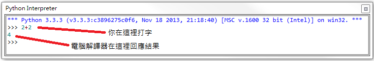
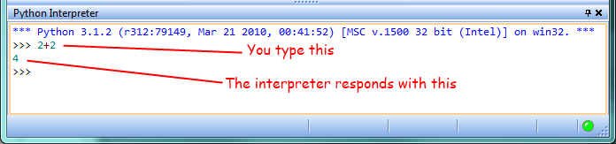
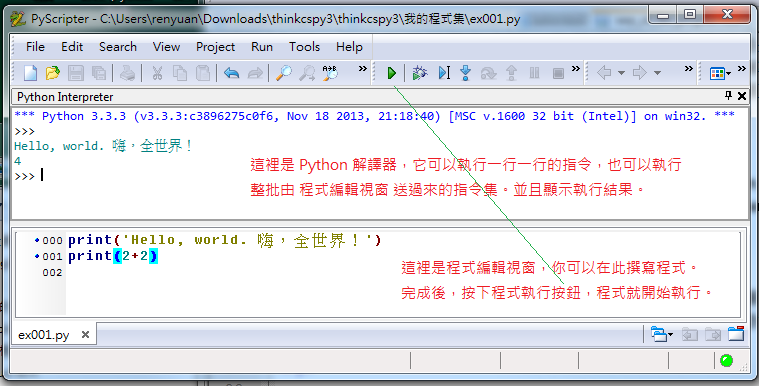
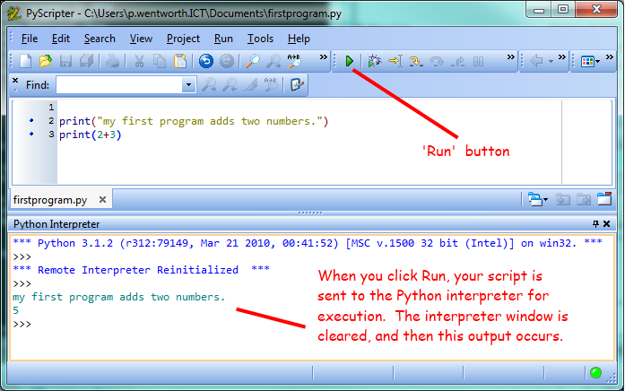


..  Copyright (C)  Peter Wentworth, Jeffrey Elkner, Allen B. Downey and Chris Meyers.
    Permission is granted to copy, distribute and/or modify this document
    under the terms of the GNU Free Documentation License, Version 1.3
    or any later version published by the Free Software Foundation;
    with Invariant Sections being Foreword, Preface, and Contributor List, no
    Front-Cover Texts, and no Back-Cover Texts.  A copy of the license is
    included in the section entitled "GNU Free Documentation License".

    
|    
    
The way of the program
======================
程式設計之「道」

The goal of this book is to teach you to think like a computer scientist. 
This way of thinking combines some of the best features of mathematics, engineering, and natural science. 
Like mathematicians, computer scientists use formal languages to denote ideas (specifically computations). 
Like engineers, they design things, assembling components into systems and evaluating tradeoffsamong alternatives.  
Like scientists, they observe the behavior of complex systems, form hypotheses, and test predictions.

這本書的目的是教你像計算機科學家一樣的思考。 
這種思考方式結合了數學、工程學和自然科學的最佳特色。 
像數學家、計算機科學家使用抽象的形式語言來表達思想（特別是計算過程）。 像工程師設計物品、組裝元件成為系統，以及評估利弊得失以選擇最佳方案來執行。 像科學家觀察複雜系統的行為、提出假設，進而測試所預測的行為。

The single most important skill for a computer scientist is **problem solving**. 
Problem solving means the ability to formulate problems, think creatively about solutions, and express a solution clearly and accurately. 
As it turns out, the process of learning to program is an excellent opportunity to practice problem-solving skills. 
That's why this chapter is called, the way of the program.

對於一個計算機科學家來說，他最重要的技能是就是解決問題。 解決問題意思是指，把問題說清楚，創造性地思考解決方案，並且清晰準確的表達出解決之道。 而事實證明，學習設計程式的過程就是培養解決問題的能力的極佳機會。 
這就是為什麼這一章被稱為「程式設計之『道』」。

On one level, you will be learning to program, a useful skill by itself. 
On another level, you will use programming as a means to an end. 
As we go along, that end will become clearer.

在一個層面上，你會學到程式設計，它本身就是一個有用的技能。 
而在另一個層面上，你也可以把程式設計當作是協助你到達目的的手段。 
隨著你越學越多，這個層次的目的將越來越清楚。

.. index:: programming language, portable, high-level language, low-level language, compile, interpret, PyScripter
.. index:: 程式語言, 可攜的, 高階程式語言, 編譯, 解譯

The Python programming language
-------------------------------
Python 程式語言

The programming language you will be learning is Python. 
Python is an example of a **high-level language**; 
other high-level languages you might have heard of are C++, PHP, Pascal, C#, and Java.

你將要學習的程式語言是 Python 。
Python 是一種 **高階語言** ;
你可能聽說過其他高階語言是像是 C++, PHP, Pascal, C# 以及 Java。

As you might infer from the name high-level language, there are also **low-level languages**, 
sometimes referred to as machine languages or assembly languages. 
Loosely speaking, computers can only execute programs written in low-level languages. 
Thus, programs written in a high-level language have to be translated into something more suitable before they can run. 

你可能也會連想到既然有高階語言，就應該也有 **低階語言** 才對，
沒錯，這些低階語言有時也稱為機器語言或組合語言。
粗略地講，計算機只能執行用低階語言編寫的程式。
因此，用高階語言所寫的程式必須被翻譯一下，才可以在電腦中執行。 

Almost all programs are written in high-level languages because of their advantages.
It is much easier to program in a high-level language so programs take less time to write, 
they are shorter and easier to read, and they are more likely to be correct. 
Second, high-level languages are **portable**, meaning that they can run on different kinds of computers with few or no modifications.  

現今幾乎所有的程式都是用高階語言寫成的，因為它們有很多優點。
他們遠較低階語言容易使用，因此寫程式的時間大大的減少。
這是很容易在高級語言編程使程序需要較少的寫入時間，
它們篇幅較短，較易閱讀，較少出錯。
其次，高階語言 **可攜的** ，這意思是說它們幾乎可以在不同類型的計算機執行，
所需的修改很少或根本不用修改即可執行。

The engine that translates and runs Python is called the **Python Interpreter**: 
There are two ways to use it: *immediate mode* and *script mode*. 
In immediate mode, you type Python expressions into the Python Interpreter window, 
and the interpreter immediately shows the result:

用來翻譯並執行 Python 程式的引擎稱為 Python 解譯器：
使用它的方式有兩種： *即時模式* 和 *腳本模式* 。
在即時模式下，你輸入 Python 表達式到 Python 解釋器視窗，
解釋器會立即顯示結果：

   

The ``>>>`` is called the **Python prompt**. 
The interpreter uses the prompt to indicate that it is ready for instructions. 
We typed ``2 + 2``, and the interpreter evaluated our expression, 
and replied ``4``, and on the next line it gave a new prompt, 
indicating that it is ready for more input.   

那個 ``>>>`` 稱為 ** Python 提示符** 。
解譯器用那個提示符來表示它已準備好要接受指令了。
我們鍵入 `` 2 +2 `` ，解譯器計算我們的式子，
並回應出 `` 4 `` ，而且在下一行它給了一個新的提示符，
表示它又準備好要接受另外的輸入了。

Alternatively, you can write a program in a file and use the interpreter to execute the contents of the file. 
Such a file is called a **script**.   
Scripts have the advantage that they can be saved to disk, printed, and so on. 

或者，你可以在一個新開的文字檔案中編寫一個程式，並使用解釋器來執行該文字檔案的內容。
這樣的文字檔案被稱為一個 **腳本** (演員演戲時所根據的台詞文案)。
腳本有個好處是它們可以被保存到磁碟，也可以列印出來進一步修改或擴增。
   
In this Rhodes Local Edition of the textbook, we use a program development environment called **PyScripter**. 
(It is available at http://code.google.com/p/pyscripter.)  
There are various other development environments. 
If you're using one of the others, you might be better off working with the authors' original book rather than this edition.

在本教科書的羅茲地方版，我們使用一個名為 ** PyScripter ** 一個程式開發環境。
（它可取自 http://code.google.com/p/pyscripter 。 ）
還有其他各種開發環境。
如果你使用的是其他各種開發環境。
你可能應該參考那些環境的作者的原書，而暫時不用這個版本。

For example, we created a file named ``firstprogram.py`` using PyScripter.
By convention, files that contain Python programs have names that end with ``.py``

例如，我們使用 PyScripter 創建了一個名為 `` firstprogram.py `` 的文件。
按照慣例，包含 Python 程式的文字檔案 以 ``.py `` 作為結尾。

To execute the program, we can click the **Run** button in PyScripter:

要執行這個程式，我們可以用滑鼠點擊 PyScripter 的 **Run** 按鈕：

   

   
Most programs are more interesting than this one.

大部分的程式都比上面這個程式有趣。

Working directly in the interpreter is convenient for testing short bits of code because you get immediate feedback. 
Think of it as scratch paper used to help you work out problems. 
Anything longer than a few lines should be put into a script.

直接在解釋器上寫程式其優點是方便測試小程式片段，
並即時得到程式執行的結果。
就像你隨便抓一張草稿紙來思考問題一樣。
稍微長一點的程式就該放在腳本的檔案之中。

.. index:: program, algorithm
.. index:: 程式, 演算法

What is a program?
------------------
什麼是「程式」？

A **program** is a sequence of instructions that specifies how to perform a computation. 

一個 **程式** 就是一串指令的集合，它告訴電腦如何執行運算。 

The computation might be something mathematical, 
such as solving a system of equations or finding the roots of a polynomial, 
but it can also be a symbolic computation, 
such as searching and replacing text in a document or (strangely enough) compiling a program.

運算可能是跟數學有關， 
例如求解方程組或解多項式的根， 
但它也可以是符號運算，
例如在文檔中搜索和取代文字，
甚至是「編譯程式」都有可能(夠怪的吧！)。 

The details look different in different languages, but a few basic instructions appear in just about every language:

雖然在不同的語言中，細節各自不同，
但有幾個基本的指令幾乎在所有語言中都會出現：

input
    Get data from the keyboard, a file, or some other device.

output
    Display data on the screen or send data to a file or other device.

math
    Perform basic mathematical operations like addition and multiplication.

conditional execution
    Check for certain conditions and execute the appropriate sequence of
    statements.

repetition
    Perform some action repeatedly, usually with some variation.

輸入 
    從鍵盤、滑鼠、磁碟檔案、麥克風、攝影鏡頭或其他設備的取得資料。 

輸出 
    在螢幕上顯示資料或發送資料到磁碟檔案或其它設備。 

數學 
    執行像加法和乘法等基本的數學運算。 

條件執行 
    檢查當下狀態是否符合一定的條件，並根據檢查結果執行適當的敘述。  

重複 
    重複執行某些動作，這些動作通常帶有一些變異。    
    
    
Believe it or not, that's pretty much all there is to it. 
Every program you've ever used, no matter how complicated, 
is made up of instructions that look more or less like these. 
Thus, we can describe programming as the process of breaking a large, 
complex task into smaller and smaller subtasks until the subtasks are simple enough to be performed with sequences of these basic
instructions.

That may be a little vague, but we will come back to this topic later when we talk about **algorithms**.

信不信由你，這幾乎就是全部該有的了。 
你曾經使用過的每一個程式，無論它有多麼複雜，
都是由類似這些型態的指令所構成。
因此，我們可以把寫程式描述成，
一個把大任務不斷細分成小任務，
直到任務小到可以用以上所稱的基本指令來完成為止。

這樣說可能還有點含糊，
但當我們談論到 **演算法** 時，
我們還會回到這個話題後。

.. index:: debugging, bug
.. index:: 除蟲, 蟲

What is debugging?
------------------
什麼是「除蟲」？

Programming is a complex process, and because it is done by human beings, it
often leads to errors. Programming errors are called
**bugs** and the process of tracking them down and correcting them is called
**debugging**.  Use of the term *bug* to describe small engineering difficulties
dates back to at least 1889, when Thomas Edison had a bug with his phonograph.

Three kinds of errors can occur in a program: `syntax errors
<http://en.wikipedia.org/wiki/Syntax_error>`__, `runtime errors
<http://en.wikipedia.org/wiki/Runtime_error>`__, and `semantic errors
<http://en.wikipedia.org/wiki/Logic_error>`__.  It is useful to
distinguish between them in order to track them down more quickly.

.. index:: syntax, syntax error

Syntax errors
-------------
語法錯誤

Python can only execute a program if the program is syntactically correct;
otherwise, the process fails and returns an error message.  **Syntax** refers
to the structure of a program and the rules about that structure. For example,
in English, a sentence must begin with a capital letter and end with a period.
this sentence contains a **syntax error**. So does this one  

For most readers, a few syntax errors are not a significant problem, which is
why we can read the poetry of E. E. Cummings without problems.
Python is not so forgiving. If there is a single syntax error anywhere in your
program, Python will display an error message and quit, and you will not be able
to run your program. During the first few weeks of your programming career, you
will probably spend a lot of time tracking down syntax errors. As you gain
experience, though, you will make fewer errors and find them faster.

.. index:: runtime error, exception, safe language

Runtime errors
--------------
執行時期錯誤

The second type of error is a runtime error, so called because the error does
not appear until you run the program. These errors are also called
**exceptions** because they usually indicate that something exceptional (and
bad) has happened.

Runtime errors are rare in the simple programs you will see in the first few
chapters, so it might be a while before you encounter one.

.. index:: semantics, semantic error

Semantic errors
---------------
語意錯誤

The third type of error is the **semantic error**. If there is a semantic error
in your program, it will run successfully, in the sense that the computer will
not generate any error messages, but it will not do the right thing. It will do
something else. Specifically, it will do what you told it to do.

The problem is that the program you wrote is not the program you wanted to
write. The meaning of the program (its semantics) is wrong.  Identifying
semantic errors can be tricky because it requires you to work backward by
looking at the output of the program and trying to figure out what it is doing.

.. index::
    single: Holmes, Sherlock
    single: Doyle, Arthur Conan 
    single: Linux

Experimental debugging
----------------------
實驗性的「除蟲」

One of the most important skills you will acquire is debugging.  Although it
can be frustrating, debugging is one of the most intellectually rich,
challenging, and interesting parts of programming.

In some ways, debugging is like detective work. You are confronted with clues,
and you have to infer the processes and events that led to the results you see.

Debugging is also like an experimental science. Once you have an idea what is
going wrong, you modify your program and try again. If your hypothesis was
correct, then you can predict the result of the modification, and you take a
step closer to a working program. If your hypothesis was wrong, you have to
come up with a new one. As Sherlock Holmes pointed out, When you have
eliminated the impossible, whatever remains, however improbable, must be the
truth. (A. Conan Doyle, *The Sign of Four*)

For some people, programming and debugging are the same thing. That is,
programming is the process of gradually debugging a program until it does what
you want. The idea is that you should start with a program that does
*something* and make small modifications, debugging them as you go, so that you
always have a working program.

For example, Linux is an operating system kernel that contains millions of
lines of code, but it started out as a simple program Linus Torvalds used to
explore the Intel 80386 chip. According to Larry Greenfield, one of Linus's
earlier projects was a program that would switch between displaying AAAA and
BBBB. This later evolved to Linux (*The Linux Users' Guide* Beta Version 1).

Later chapters will make more suggestions about debugging and other programming
practices.

.. index:: formal language, natural language, parse, token

Formal and natural languages
----------------------------
人造(形式)語言 和 自然語言

**Natural languages** are the languages that people speak, such as English,
Spanish, and French. They were not designed by people (although people try to
impose some order on them); they evolved naturally.

**Formal languages** are languages that are designed by people for specific
applications. For example, the notation that mathematicians use is a formal
language that is particularly good at denoting relationships among numbers and
symbols. Chemists use a formal language to represent the chemical structure of
molecules. And most importantly:

    *Programming languages are formal languages that have been designed to
    express computations.*

Formal languages tend to have strict rules about syntax. For example, ``3+3=6``
is a syntactically correct mathematical statement, but ``3=+6$`` is not.
H\ :sub:`2`\ O is a syntactically correct chemical name, but :sub:`2`\ Zz is
not.

Syntax rules come in two flavors, pertaining to **tokens** and structure.
Tokens are the basic elements of the language, such as words, numbers, parentheses,
commas, and so on. In Python, a statement like ``print("Happy New Year for ",2013)`` 
has 6 tokens: a function name, an open parenthesis (round bracket), a string, a comma, a number, and a close parenthesis.

It is possible to make errors in the way one constructs tokens.  
One of the problems with ``3=+6$`` is that ``$`` is not a
legal token in mathematics (at least as far as we know). Similarly,
:sub:`2`\ Zz is not a legal token in chemistry notation because there is no element with the abbreviation
``Zz``.

The second type of syntax rule pertains to the **structure** of a statement--- that
is, the way the tokens are arranged. The statement ``3=+6$`` is structurally
illegal because you can't place a plus sign immediately after an equal sign.
Similarly, molecular formulas have to have subscripts after the element name,
not before.  And in our Python example, if we omitted the comma, or if we changed the two
parentheses around to say  ``print)"Happy New Year for ",2013(`` our statement would still
have six legal and valid tokens, but the structure is illegal.

When you read a sentence in English or a statement in a formal language, you
have to figure out what the structure of the sentence is (although in a natural
language you do this subconsciously). This process is called **parsing**.

For example, when you hear the sentence, "The other shoe fell", you understand
that the other shoe is the subject and fell is the verb.  Once you have parsed
a sentence, you can figure out what it means, or the **semantics** of the sentence.
Assuming that you know what a shoe is and what it means to fall, you will
understand the general implication of this sentence.

Although formal and natural languages have many features in common --- tokens,
structure, syntax, and semantics --- there are many differences:

.. glossary::

    ambiguity
        Natural languages are full of ambiguity, which people deal with by
        using contextual clues and other information. Formal languages are
        designed to be nearly or completely unambiguous, which means that any
        statement has exactly one meaning, regardless of context.

    redundancy
        In order to make up for ambiguity and reduce misunderstandings, natural
        languages employ lots of redundancy. As a result, they are often
        verbose.  Formal languages are less redundant and more concise.

    literalness
        Formal languages mean exactly what they say.  On the other hand, natural languages 
        are full of idiom and metaphor. If someone says, "The
        other shoe fell", there is probably no shoe and nothing falling.  
        You'll need to find the 
        original joke to understand the idiomatic meaning of the other shoe falling. 
        *Yahoo! Answers* thinks it knows!  

People who grow up speaking a natural language---everyone---often have a hard
time adjusting to formal languages. In some ways, the difference between formal
and natural language is like the difference between poetry and prose, but more
so:

.. glossary::

    poetry
        Words are used for their sounds as well as for their meaning, and the
        whole poem together creates an effect or emotional response. Ambiguity
        is not only common but often deliberate.

    prose
        The literal meaning of words is more important, and the structure
        contributes more meaning. Prose is more amenable to analysis than
        poetry but still often ambiguous.

    program
        The meaning of a computer program is unambiguous and literal, and can
        be understood entirely by analysis of the tokens and structure.

Here are some suggestions for reading programs (and other formal languages).
First, remember that formal languages are much more dense than natural
languages, so it takes longer to read them. Also, the structure is very
important, so it is usually not a good idea to read from top to bottom, left to
right. Instead, learn to parse the program in your head, identifying the tokens
and interpreting the structure.  Finally, the details matter. Little things
like spelling errors and bad punctuation, which you can get away with in
natural languages, can make a big difference in a formal language.

The first program
-----------------
第一支程式

Traditionally, the first program written in a new language is called *Hello, World!* 
because all it does is display the words, Hello, World!  
In Python, the script looks like this: 
(For scripts, we'll show line numbers to the left of the Python statements.)

    .. sourcecode:: python3
        :linenos:
        
        print("Hello, World!")

傳統上，學習一種新的語言所寫的第一支程式就是所謂的 "Hello，World！(嗨，全世界！)" 。 
因為它所作的僅僅是讓電腦把這些字 "Hello，World！(嗨，全世界！)" 顯示在螢幕上。 
以 Python 語言來講，這個程式是這樣寫的： 
（在本書中，對於任何 Python 程式碼，我們都會在 Python 語句的左邊顯示程式碼的行號，以利追蹤和說明。）

    .. sourcecode:: python3
        :linenos:
        
        print("Hello，World！(嗨，全世界！)")        
        
This is an example of using the **print function**, which doesn't actually print
anything on paper. It displays a value on the screen. In this case, the result shown
is

    .. sourcecode:: python3
        :linenos:
        
        Hello, World!

這是一個利用 **print 函數** 的例子，實際上它並不是印出什麼東西在紙上。 而只是在螢幕上顯示出一些數值(或文字)。在這個例子中，螢幕顯示的結果如下：

    .. sourcecode:: python3
        :linenos:
        
        Hello，World！(嗨，全世界！)
        

The quotation marks in the program mark the beginning and end of the value;
they don't appear in the result.

Some people judge the quality of a programming language by the simplicity of the Hello, World! program. 
By this standard, Python does about as well as
possible.

在本程式中，前後 2 個「雙引號」 "   " 標示著文字串的開頭和結尾，它們不會出現在所印出的結果中。

有人用寫出 Hello, World!(嗨，全世界！) 這個程式的簡單性來判斷一個程式語言的品質。
根據這個標準，Python 的表現相當優異。

.. index:: comment

Comments
--------
註解

As programs get bigger and more complicated, they get more difficult to read.
Formal languages are dense, and it is often difficult to look at a piece of
code and figure out what it is doing, or why.

隨著程式越寫越大，越來越複雜，它們也越來越難以閱讀。程式語言是很精要的(有時像是中文裡面的文言文)， 而且往往很難只看到一小段程式碼，就弄清楚它在做什麼，或者為什麼它要這樣做。

For this reason, it is a good idea to add notes to your programs to explain in
natural language what the program is doing.  

基於這個原因，程式設計師最好也能用「自然語言」(像中文、英文、日文等)， 添加一些註解到你的程式中，來輔助說明程式碼的意思，以便自己或別人將來能理解這個程式。

A **comment** in a computer program is text that is intended
only for the human reader --- it is completely ignored by the interpreter.

在程式中的註解是要給人看的，電腦的解譯器會完全忽略它們。

In Python, the `#` token starts a comment.  The rest of the line 
is ignored.   Here is a new version of *Hello, World!*.

在 Python 中，# 記號用來 作為一段註解的開始。該行從# 記號以後的部分通通被電腦忽略。 
以下就是的Hello, World!(嗨，全世界！) 這個程式的新版本！

    .. sourcecode:: python3
        :linenos:
        
        #---------------------------------------------------
        # This demo program shows off how elegant Python is!
        # Written by Joe Soap, December 2010.
        # Anyone may freely copy or modify this program.
        #---------------------------------------------------
        
        print("Hello, World!")     # Isn't this easy! 
      

    .. sourcecode:: python3
        :linenos:
        
        #---------------------------------------------------
        # 這支程式展現 Python 程式語言的優雅！
        # 由 呂仁園 所寫，2014/03/03 
        # 任何人都可以自由修改這個程式。
        #---------------------------------------------------

        print("Hello, World!(嗨，全世界！)")     # 這很簡單吧！

      
You'll also notice that we've left a blank line in the program.  
Blank lines are also ignored by the interpreter, 
but comments and blank lines can make your programs much easier for humans to parse.  
Use them liberally! 

您還會注意到，我們在程式中留了一些空白行。 
空白行和註解一樣也會被電腦忽略， 
但它們都可以讓你的程式更容易讓自己或別人了解。 
儘量使用它們吧！

Glossary
--------
詞彙集

.. glossary::

    algorithm
        A set of specific steps for solving a category of problems.

    bug
        An error in a program.

    comment
        Information in a program that is meant for other programmers (or anyone
        reading the source code) and has no effect on the execution of the
        program.    

    debugging
        The process of finding and removing any of the three kinds of
        programming errors.

    exception
        Another name for a runtime error.

    formal language
        Any one of the languages that people have designed for specific
        purposes, such as representing mathematical ideas or computer programs;
        all programming languages are formal languages.

    high-level language
        A programming language like Python that is designed to be easy for
        humans to read and write.

    immediate mode
        A style of using Python where we type expressions at the command prompt, and 
        the results are shown immediately.  Contrast with **script**, and see the
        entry under **Python shell**.
    
    interpreter
        The engine that executes your Python scripts or expressions.
        
    low-level language
        A programming language that is designed to be easy for a computer to
        execute; also called machine language or assembly language.

    natural language
        Any one of the languages that people speak that evolved naturally.

    object code
        The output of the compiler after it translates the program.

    parse
        To examine a program and analyze the syntactic structure.

    portability
        A property of a program that can run on more than one kind of computer.

    print function
        A function used in a program or script that causes the Python interpreter to 
        display a value on its output device.

    problem solving
        The process of formulating a problem, finding a solution, and
        expressing the solution.

    program
        a sequence of instructions that specifies to a computer actions and
        computations to be performed.

    Python shell
        An interactive user interface to the Python interpreter. The user of a
        Python shell types commands at the prompt (>>>), and presses the return
        key to send these commands immediately to the interpreter for
        processing.  The word *shell* comes from Unix.  In the PyScripter 
        used in this RLE version of the book, the Interpreter Window is where
        we'd do the immediate mode interaction.  

    runtime error
        An error that does not occur until the program has started to execute
        but that prevents the program from continuing.

    script
        A program stored in a file (usually one that will be interpreted).

    semantic error
        An error in a program that makes it do something other than what the
        programmer intended.

    semantics
        The meaning of a program.

    source code
        A program in a high-level language before being compiled.

    syntax
        The structure of a program.

    syntax error
        An error in a program that makes it impossible to parse --- and
        therefore impossible to interpret.

    token
        One of the basic elements of the syntactic structure of a program,
        analogous to a word in a natural language.

Exercises
---------
習題

#. Write an English sentence with understandable semantics but incorrect syntax. 
   Write another English sentence which has correct syntax but has semantic errors.
   
#. Using the Python interpreter, type ``1 + 2`` and then hit return. Python *evaluates* 
   this *expression*, displays the result, and then shows another prompt. ``*``
   is the *multiplication operator*, and ``**`` is the
   *exponentiation operator*. Experiment by entering different expressions and
   recording what is displayed by the Python interpreter. 

#. Type ``1 2`` and then hit return. Python tries to evaluate the expression,
   but it can't because the expression is not syntactically legal. Instead, it
   shows the error message:
   
        .. sourcecode:: python3

              File "<interactive input>", line 1
                1 2
                  ^
            SyntaxError: invalid syntax

   In many cases, Python indicates where the syntax error occurred, but it is
   not always right, and it doesn't give you much information about what is
   wrong.
   
   So, for the most part, the burden is on you to learn the syntax rules.
   
   In this case, Python is complaining because there is no operator between the
   numbers.
   
   See if you can find a few more examples of things that will produce error
   messages when you enter them at the Python prompt. Write down what you enter
   at the prompt and the last line of the error message that Python reports
   back to you. 
   
#. Type  ``print("hello")``. Python executes this, which has the effect
   of printing the letters h-e-l-l-o. Notice that the quotation marks that you
   used to enclose the string are not part of the output.  Now type ``"hello"``
   and describe your result.  Make notes of when you see the quotation marks
   and when you don't.
    
#. Type ``cheese`` without the quotation marks. The output will look
   something like this::

        Traceback (most recent call last):
          File "<interactive input>", line 1, in ?
        NameError: name 'cheese' is not defined

   This is a run-time error; specifically, it is a NameError, and even more
   specifically, it is an error because the name `cheese` is not defined. If
   you don't know what that means yet, you will soon.

#. Type ``6 + 4 * 9`` at the Python prompt and hit enter.  Record what happens.
   
   Now create a Python script with the following contents:

       .. sourcecode:: python3
          :linenos:
        
           6 + 4 * 9

   What happens when you run this script? Now change the script contents to:

       .. sourcecode:: python3
           :linenos:
        
           print(6 + 4 * 9)

   and run it again.
   
   What happened this time?
   
   Whenever an *expression* is typed at the Python prompt, it is evaluated
   and the result is *automatically* shown on the line below.  (Like on your calculator,
   if you type this expression you'll get the result 42.)   
   
   A script is different, however.  Evaluations of
   expressions are not automatically displayed, 
   so it is necessary to use the **print** function to make the answer
   show up.  
   
   It is hardly ever necessary to use the print function in immediate mode at the command prompt.  
